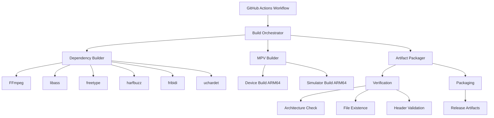

# Design Document: iOS MPV Library Build System

## Overview

This document describes the design of an automated build system for compiling the MPV media player library and its dependencies for iOS platforms. The system leverages GitHub Actions to provide reproducible, automated builds targeting ARM64 architecture for both iOS devices and simulators.

### Purpose

The build system enables iOS developers to integrate MPV video playback capabilities into their applications by providing pre-compiled library artifacts. The automation ensures consistency, reproducibility, and ease of maintenance.

### Scope

The system encompasses:
- Cross-compilation of MPV and all required dependencies for iOS ARM64 targets
- GitHub Actions workflow automation for continuous integration
- Build artifact organization and verification
- Modular build scripts for maintainability
- Comprehensive error handling and logging

### Key Design Decisions

1. **ARM64-Only Support**: Modern iOS devices and simulators use ARM64 architecture exclusively, eliminating the need for legacy architectures (armv7, x86_64 simulator support)
2. **Meson Build System**: MPV transitioned from waf to Meson, which provides better cross-compilation support and cleaner configuration
3. **Static Linking**: All dependencies are compiled as static libraries and linked into MPV to simplify distribution
4. **GitHub Actions on macOS**: iOS cross-compilation requires macOS with Xcode, making GitHub's macOS runners the natural choice
5. **Modular Script Architecture**: Separate build scripts for each dependency enable independent testing and debugging

## Architecture

### System Components



### Build Pipeline Flow

The build process follows a sequential pipeline:

1. **Environment Setup**: Configure macOS runner with Xcode and required tools
2. **Dependency Resolution**: Download source tarballs for MPV and all dependencies
3. **Cross-Compilation Configuration**: Set up iOS SDK paths, compiler flags, and toolchain
4. **Dependency Compilation**: Build each dependency library in dependency order
5. **MPV Compilation**: Build MPV library linking against compiled dependencies
6. **Verification**: Validate architecture, file existence, and completeness
7. **Packaging**: Organize artifacts and create release package
8. **Upload**: Store artifacts for distribution

### Target Configurations

Two distinct build configurations are required:

**iOS Device (ARM64)**
- Target: `aarch64-apple-ios`
- SDK: `iphoneos`
- Minimum deployment: iOS 12.0
- Architecture: `arm64`

**iOS Simulator (ARM64)**
- Target: `aarch64-apple-ios-simulator`
- SDK: `iphonesimulator`
- Minimum deployment: iOS 12.0
- Architecture: `arm64`

## Components and Interfaces

### 1. GitHub Actions Workflow

**File**: `.github/workflows/build-ios.yml`

**Responsibilities**:
- Trigger on push/pull request events
- Configure macOS runner environment
- Execute build orchestrator script
- Upload build artifacts
- Report build status

**Configuration**:
```yaml
runs-on: macos-latest
timeout-minutes: 120
```

**Outputs**:
- Build artifacts (uploaded to GitHub Actions)
- Build logs
- Status badges

### 2. Build Orchestrator Script

**File**: `scripts/build-orchestrator.sh`

**Responsibilities**:
- Coordinate execution of all build steps
- Manage build state and caching
- Handle clean vs incremental builds
- Aggregate logs and errors
- Invoke verification and packaging

**Interface**:
```bash
./build-orchestrator.sh [OPTIONS]
  --clean          : Clean all previous build artifacts
  --target TARGET  : Build for specific target (device|simulator|all)
  --incremental    : Enable incremental build (skip unchanged)
  --verbose        : Enable verbose logging
```

**Environment Variables**:
- `IOS_SDK_PATH`: Path to iOS SDK
- `MIN_IOS_VERSION`: Minimum iOS deployment target
- `BUILD_DIR`: Root directory for build outputs
- `CACHE_DIR`: Directory for cached dependencies

### 3. Dependency Build Scripts

Individual scripts for each dependency library:

**Files**:
- `scripts/build-ffmpeg.sh`
- `scripts/build-libass.sh`
- `scripts/build-freetype.sh`
- `scripts/build-harfbuzz.sh`
- `scripts/build-fribidi.sh`
- `scripts/build-uchardet.sh`

**Common Interface**:
```bash
./build-<library>.sh TARGET ARCH SDK_PATH
  TARGET   : device or simulator
  ARCH     : arm64
  SDK_PATH : Path to iOS SDK
```

**Responsibilities**:
- Download source if not cached
- Configure cross-compilation for iOS
- Compile library for specified target
- Install to staging directory
- Log compilation details

**Output Structure**:
```
build/
  device/
    lib/
      lib<name>.a
    include/
      <headers>
  simulator/
    lib/
      lib<name>.a
    include/
      <headers>
```

### 4. MPV Build Script

**File**: `scripts/build-mpv.sh`

**Responsibilities**:
- Configure MPV with Meson for iOS cross-compilation
- Link against compiled dependencies
- Build libmpv static library
- Install headers and library files

**Interface**:
```bash
./build-mpv.sh TARGET ARCH SDK_PATH DEPS_PATH
  TARGET    : device or simulator
  ARCH      : arm64
  SDK_PATH  : Path to iOS SDK
  DEPS_PATH : Path to compiled dependencies
```

**Meson Configuration**:
```python
meson setup build \
  --cross-file=ios-cross.txt \
  --default-library=static \
  --prefix=$INSTALL_PREFIX \
  -Dlibmpv=true \
  -Dcplayer=false \
  -Dlua=disabled \
  -Djavascript=disabled
```

### 5. Cross-Compilation Configuration

**File**: `scripts/ios-cross.txt` (Meson cross-file)

**Content**:
```ini
[binaries]
c = 'clang'
cpp = 'clang++'
ar = 'ar'
strip = 'strip'

[properties]
sys_root = '/path/to/iOS/SDK'
c_args = ['-arch', 'arm64', '-mios-version-min=12.0']
cpp_args = ['-arch', 'arm64', '-mios-version-min=12.0']
c_link_args = ['-arch', 'arm64']
cpp_link_args = ['-arch', 'arm64']

[host_machine]
system = 'darwin'
cpu_family = 'aarch64'
cpu = 'arm64'
endian = 'little'
```

### 6. Verification Module

**File**: `scripts/verify-build.sh`

**Responsibilities**:
- Verify all expected library files exist
- Check architecture of compiled binaries using `lipo`
- Validate header file presence
- Ensure libraries are not empty
- Generate verification report

**Interface**:
```bash
./verify-build.sh BUILD_DIR
  BUILD_DIR : Root directory containing build outputs
```

**Checks Performed**:
```bash
# Architecture verification
lipo -info libmpv.a | grep "arm64"

# File existence
test -f libmpv.a && test -s libmpv.a

# Header validation
test -f mpv/client.h
```

### 7. Packaging Module

**File**: `scripts/package-artifacts.sh`

**Responsibilities**:
- Organize libraries and headers into distribution structure
- Generate manifest file listing all artifacts
- Create compressed archive for release
- Separate debug symbols if present

**Interface**:
```bash
./package-artifacts.sh BUILD_DIR OUTPUT_DIR
  BUILD_DIR  : Root directory containing build outputs
  OUTPUT_DIR : Destination for packaged artifacts
```

**Output Structure**:
```
ios-mpv-library-release/
  device/
    lib/
      libmpv.a
      libffmpeg.a
      libass.a
      ...
    include/
      mpv/
        client.h
        ...
  simulator/
    lib/
      libmpv.a
      ...
    include/
      mpv/
        client.h
        ...
  manifest.json
  README.md
```

**Manifest Format** (`manifest.json`):
```json
{
  "version": "0.1.0",
  "build_date": "2025-01-15T10:30:00Z",
  "targets": {
    "device": {
      "architecture": "arm64",
      "sdk": "iphoneos",
      "min_ios_version": "12.0",
      "libraries": [
        "libmpv.a",
        "libffmpeg.a",
        "libass.a"
      ]
    },
    "simulator": {
      "architecture": "arm64",
      "sdk": "iphonesimulator",
      "min_ios_version": "12.0",
      "libraries": [
        "libmpv.a",
        "libffmpeg.a",
        "libass.a"
      ]
    }
  }
}
```

## Data Models

### Build Configuration

```typescript
interface BuildConfiguration {
  target: 'device' | 'simulator';
  architecture: 'arm64';
  sdk: 'iphoneos' | 'iphonesimulator';
  sdkPath: string;
  minIOSVersion: string;
  compilerFlags: string[];
  linkerFlags: string[];
  enableBitcode: boolean;
  optimizationLevel: '-O0' | '-Os' | '-O2' | '-O3';
  debugSymbols: boolean;
}
```

### Dependency Specification

```typescript
interface Dependency {
  name: string;
  version: string;
  sourceUrl: string;
  buildScript: string;
  dependencies: string[];  // Other dependencies required
  configureFlags: string[];
}
```

### Build Artifact

```typescript
interface BuildArtifact {
  name: string;
  type: 'static_library' | 'header' | 'framework';
  path: string;
  target: 'device' | 'simulator';
  architecture: string;
  size: number;
  checksum: string;
}
```

### Build Result

```typescript
interface BuildResult {
  success: boolean;
  target: 'device' | 'simulator';
  duration: number;  // seconds
  artifacts: BuildArtifact[];
  logs: string;
  errors?: string[];
}
```

## Error Handling

### Error Categories

1. **Environment Errors**: Missing Xcode, SDK not found, insufficient disk space
2. **Download Errors**: Network failures, invalid URLs, checksum mismatches
3. **Configuration Errors**: Invalid cross-compilation setup, missing dependencies
4. **Compilation Errors**: Syntax errors, linker failures, missing symbols
5. **Verification Errors**: Wrong architecture, missing files, empty libraries

### Error Handling Strategy

**Detection**:
- Check exit codes of all commands
- Validate file existence before proceeding
- Verify environment prerequisites upfront

**Reporting**:
- Log full error output to dedicated error log
- Include context (which step, which library, which target)
- Preserve compiler/linker command that failed

**Recovery**:
- Fail fast on critical errors (missing SDK, invalid configuration)
- Retry transient errors (network downloads) up to 3 times
- Provide clear error messages with remediation steps

**Example Error Handling**:
```bash
# Check prerequisites
if ! command -v meson &> /dev/null; then
    echo "ERROR: Meson build system not found"
    echo "Install with: pip3 install meson"
    exit 1
fi

# Validate SDK path
if [ ! -d "$IOS_SDK_PATH" ]; then
    echo "ERROR: iOS SDK not found at $IOS_SDK_PATH"
    echo "Run: xcode-select --print-path"
    exit 1
fi

# Compilation with error capture
if ! make -j$(sysctl -n hw.ncpu) 2>&1 | tee build.log; then
    echo "ERROR: Compilation failed for $LIBRARY"
    echo "See build.log for details"
    tail -n 50 build.log
    exit 1
fi
```

### Logging Strategy

**Log Levels**:
- `INFO`: Normal build progress
- `WARN`: Non-fatal issues (cached file used, optional feature disabled)
- `ERROR`: Fatal errors that stop the build

**Log Files**:
- `build-orchestrator.log`: High-level build flow
- `build-<library>-<target>.log`: Per-library compilation logs
- `verification.log`: Artifact verification results
- `errors.log`: Aggregated errors from all steps

**Log Format**:
```
[2025-01-15 10:30:45] [INFO] [build-ffmpeg.sh] Starting FFmpeg compilation for device
[2025-01-15 10:35:12] [ERROR] [build-ffmpeg.sh] Compilation failed: undefined symbol '_av_malloc'
```

## Testing Strategy

This project involves Infrastructure as Code (build scripts and CI/CD configuration) rather than application logic with testable properties. Therefore, property-based testing is not applicable.

### Testing Approach

**1. Integration Testing**
- Execute full build pipeline on GitHub Actions
- Verify successful compilation for both device and simulator targets
- Validate artifact structure and completeness
- Test on actual iOS devices and simulators

**2. Script Unit Testing**
- Test individual build scripts in isolation
- Mock dependencies to test error handling
- Verify correct flag generation for different targets
- Test verification logic with sample artifacts

**3. Smoke Testing**
- Verify environment prerequisites are met
- Check SDK paths and tool availability
- Validate configuration file parsing
- Test clean build from scratch

**4. Verification Testing**
- Architecture validation using `lipo -info`
- Symbol presence using `nm` command
- Header completeness checks
- Library linkage validation

**5. End-to-End Testing**
- Create sample iOS app that links against built library
- Verify library loads correctly on device
- Verify library loads correctly on simulator
- Test basic MPV functionality (initialize, load video)

### Test Execution

**Local Testing**:
```bash
# Test individual dependency build
./scripts/build-ffmpeg.sh device arm64 /path/to/sdk

# Test full pipeline
./scripts/build-orchestrator.sh --clean --target all

# Test verification
./scripts/verify-build.sh build/
```

**CI Testing**:
- Triggered on every push and pull request
- Full clean build for both targets
- Artifact upload for manual testing
- Build status reported to GitHub

### Success Criteria

A build is considered successful when:
1. All dependency libraries compile without errors
2. MPV library compiles and links successfully
3. All verification checks pass (architecture, file existence, headers)
4. Artifacts can be integrated into a sample iOS app
5. Sample app runs on both device and simulator

## Dependencies

### External Dependencies

**MPV and Libraries**:
- MPV (latest stable release)
- FFmpeg (latest stable release)
- libass (subtitle rendering)
- freetype (font rendering)
- harfbuzz (text shaping)
- fribidi (bidirectional text)
- uchardet (character encoding detection)

**Build Tools**:
- Xcode Command Line Tools
- Meson build system
- Ninja build tool
- pkg-config
- Python 3.x
- Git

**GitHub Actions**:
- macOS runner (macos-latest)
- actions/checkout@v3
- actions/upload-artifact@v3
- actions/cache@v3 (for dependency caching)

### Dependency Build Order

Dependencies must be built in the following order due to inter-dependencies:

1. **freetype** (no dependencies)
2. **fribidi** (no dependencies)
3. **uchardet** (no dependencies)
4. **harfbuzz** (depends on freetype)
5. **libass** (depends on freetype, fribidi, harfbuzz)
6. **FFmpeg** (no dependencies from this list)
7. **MPV** (depends on FFmpeg, libass, and transitively all others)

## Implementation Notes

### Cross-Compilation Considerations

**SDK Path Resolution**:
```bash
XCODE_PATH=$(xcode-select -p)
IOS_SDK_PATH="$XCODE_PATH/Platforms/iPhoneOS.platform/Developer/SDKs/iPhoneOS.sdk"
SIM_SDK_PATH="$XCODE_PATH/Platforms/iPhoneSimulator.platform/Developer/SDKs/iPhoneSimulator.sdk"
```

**Compiler Flag Requirements**:
- `-arch arm64`: Specify target architecture
- `-mios-version-min=12.0`: Set minimum iOS version
- `-isysroot $SDK_PATH`: Point to iOS SDK
- `-fembed-bitcode` (optional): Enable bitcode for App Store

**Common Configuration Issues**:
- Some libraries may try to detect host system instead of target
- Disable features that require unavailable iOS APIs
- Use `--host=aarch64-apple-darwin` for autotools-based projects

### Caching Strategy

**What to Cache**:
- Downloaded source tarballs
- Compiled dependency libraries (if source unchanged)
- Build tool installations (Meson, Ninja)

**Cache Key**:
```yaml
key: ${{ runner.os }}-deps-${{ hashFiles('scripts/versions.txt') }}
```

**Cache Invalidation**:
- When dependency versions change
- When build scripts are modified
- Manual cache clear via workflow dispatch

### Performance Optimization

**Parallel Compilation**:
```bash
make -j$(sysctl -n hw.ncpu)
```

**Incremental Builds**:
- Track source file timestamps
- Skip unchanged dependencies
- Preserve build directories between runs

**Expected Build Times**:
- Clean build (all dependencies): 60-90 minutes
- Incremental build (MPV only): 5-10 minutes
- Cached build (no changes): 2-3 minutes

## Future Enhancements

### Potential Improvements

1. **XCFramework Support**: Bundle device and simulator libraries into single XCFramework
2. **Additional Architectures**: Support x86_64 simulator for older Macs (if needed)
3. **tvOS Support**: Extend build system to support tvOS targets
4. **Dependency Version Management**: Automated dependency updates via Dependabot
5. **Binary Caching**: Cache compiled libraries in GitHub Packages
6. **Build Matrix**: Test multiple iOS versions and Xcode versions
7. **Automated Testing**: Run MPV test suite on compiled libraries
8. **Documentation Generation**: Auto-generate API documentation from headers

### Scalability Considerations

- Build system designed to easily add new dependencies
- Modular scripts allow parallel development
- Configuration externalized for easy updates
- GitHub Actions matrix builds for multiple configurations
